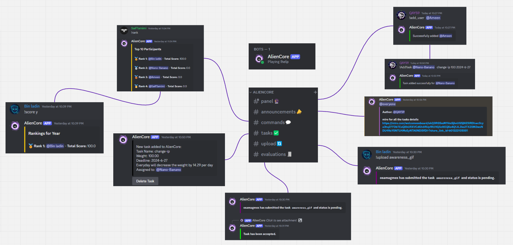
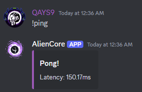
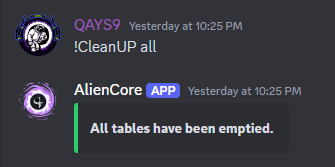

## AlienCore Performance Score Bot

AlienCore Performance Score Bot is a Discord bot designed to manage performance scores based on assigned tasks with deadlines and weights. It provides a structured system to evaluate and rate participants' performance in completing tasks within specified deadlines.



---

## Table of Contents

- [Introduction](#introduction)
- [Installation](#installation)
- [Setting Up Environment Variables](#setting-up-environment-variables)
- [Running the Bot](#running-the-bot)
- [Usage](#usage)
- [Database Schema](#database-schema)
  - [Participants Table](#participants-table)
  - [Tasks Table](#tasks-table)
  - [Evaluations and Submissions Tables](#evaluations-and-submissions-tables)
- [Script Explanation](#script-explanation)
- [Modular Design](#modular-design)
- [Error Handling](#error-handling)
- [Logging](#logging)
- [License](#license)
- [Credits](#credits)
- [Directory Structure](#directory-structure)

---

## Introduction

AlienCore Performance Score Bot facilitates the management of performance scores in Discord communities by assigning tasks to participants, evaluating their submissions, and calculating scores based on deadlines and weights assigned to tasks.

---

## Installation

1. **Clone the Repository:**
   ```bash
   git clone https://github.com/qays3/AlienCore-Performance.git
   cd AlienCore-Performance
   ```

2. **Set Up Virtual Environment (Optional but recommended):**
   ```bash
   python -m venv venv
   source venv/bin/activate   
   ```

3. **Install Dependencies:**
   ```bash
   pip install -r requirements.txt
   ```

---

## Setting Up Environment Variables

1. **Copy Environment Variables Template:**
   - Copy the `.env.example` file to `.env`:
     ```bash
     cp .env.example .env
     ```

2. **Edit `.env` File:**
   - Open the `.env` file using a text editor and update the following variables with your specific values:
     ```
     TOKEN=TOKEN_HERE
     TASK_CHANNEL_ID=TASK_CHANNEL_ID_HERE
     EVALUATIONS_ID=EVALUATIONS_ID_HERE
     ANNOUNCEMENTS_ID=ANNOUNCEMENTS_ID_HERE
     DB_HOST=localhost
     DB_USER=root
     DB_PASSWORD=
     DB_DATABASE=
     AUTHORIZED_USER_IDS=[AUTHORIZED_USER_IDS_HERE]
     ```
   - Replace `TOKEN_HERE`, `your_database_*`, and `AUTHORIZED_USER_IDS_HERE` with appropriate values.

---

## Running the Bot

- Start the bot using:
  ```bash
  nohup python main.py > output.log &
  ```
  - This command runs the bot in the background (`nohup` ensures the process continues after closing the terminal). Logs are redirected to `output.log`.

---

## Usage

After starting the bot, it connects to Discord and listens for commands prefixed with `!`. Authorized users can manage tasks, add participants, and view rankings based on task performance.

### AlienCore Performance Score Bot Help

Here are the available commands:

- **Command: ping**
  - Check bot latency
  - Usage: `!ping`
  


- **Command: add_user**
  - Add new user to database
  - Usage: `!add_user <@member>`

- **Command: AddTask**
  - Add a new task for a participant
  - Usage: `!AddTask <@member> <task_name> <weight> <deadline Format: 2024-06-20>`

- **Command: upload**
  - Upload task submission
  - Usage: `!upload <taskname>`

- **Command: tasks**
  - List tasks for a participant
  - Usage: `!tasks <@member>`

- **Command: ann**
  - Add announcements to the server
  - Usage: `!ann <message>`

- **Command: clear**
  - Clear messages in the channel
  - Usage: `!clear <number>`

- **Command: CleanUP**
  - Clean Database tables
  - Usage: Use one of the following:
    - `!CleanUP list`
    - `!CleanUP table <TableName>`
    - `!CleanUP all`
    - `!CleanUP score`



- **Command: score**
  - Rank based on datetime
  - Usage: Use one of the following:
    - `!score w <Rankings for Week>`
    - `!score m <Rankings for Month>`
    - `!score y <Rankings for Year>`

- **Command: rank**
  - Display General Rank
  - Usage: `!rank`

- **Command: help**
  - Display this help message
  - Usage: `!help`

---

## Database Schema

### Participants Table

```sql
CREATE TABLE Participants (
    id INT AUTO_INCREMENT PRIMARY KEY,
    discord_id BIGINT,  
    score FLOAT DEFAULT 0,
    created_at TIMESTAMP DEFAULT CURRENT_TIMESTAMP
);
```

- **Purpose**: Stores information about Discord participants.
- **Columns**:
  - `id`: Auto-incremented unique identifier for each participant.
  - `discord_id`: Unique identifier for the Discord user.
  - `score`: Float value representing the performance score of the participant, defaulting to `0`.
  - `created_at`: Timestamp indicating when the participant record was created.

### Tasks Table

```sql
CREATE TABLE Tasks (
    id INT AUTO_INCREMENT PRIMARY KEY,
    task_name VARCHAR(255),
    weight FLOAT,
    participant_id INT,
    deadline DATETIME,
    created_at TIMESTAMP DEFAULT CURRENT_TIMESTAMP,
    FOREIGN KEY (participant_id) REFERENCES Participants(id)
);
```

- **Purpose**: Stores information about tasks assigned to participants.
- **Columns**:
  - `id`: Auto-incremented unique identifier for each task.
  - `task_name`: Name of the task, stored as a variable-length string (up to 255 characters).
  - `weight`: Float value indicating the importance or weight of the task in performance evaluation.
  - `participant_id`: Foreign key referencing the `id` column in the `Participants` table, linking each task to the participant assigned to it.
  - `deadline`: DateTime indicating the deadline for task completion.
  - `created_at`: Timestamp indicating when the task record was created.
- **Foreign Key**: Ensures tasks are associated with a valid participant in the `Participants` table, maintaining data integrity.

### Evaluations and Submissions Tables

- **Evaluations Table**: Stores evaluations or scores given to participants for completed tasks.
- **Submissions Table**: Tracks submissions of tasks by participants, including the status of each submission.

#### Evaluations Table

```sql
CREATE TABLE Evaluations (
    id INT AUTO_INCREMENT PRIMARY KEY,
    participant_id INT,
    task_id INT,
    score FLOAT,
    status INT DEFAULT 1,
    evaluated_at DATETIME,
    FOREIGN KEY (participant_id) REFERENCES Participants(id),
    FOREIGN KEY (task_id) REFERENCES Tasks(id)
);
```

- **Purpose**: Stores evaluations or scores given to participants for completed tasks.
- **Columns**:
  - `id`: Auto-incremented unique identifier for each evaluation.
  - `participant_id`: Foreign key referencing the `id` column in the `Participants` table, identifying the participant being evaluated.
  - `task_id`: Foreign key referencing the `id` column in the `Tasks` table, identifying the task for which the evaluation is given.
  - `score`: Float value representing the evaluation score given to the participant for the task.
  - `status`: Integer indicating the status of the evaluation (defaulted to `1`), which can be used for tracking or filtering evaluations.
  - `evaluated_at`: DateTime indicating when the evaluation was recorded.

#### Submissions Table

```sql
CREATE TABLE Submissions (
    id INT AUTO_INCREMENT PRIMARY KEY,
    participant_id INT,
    task_id INT,
    status ENUM('pending', 'accepted', 'rejected'),
    submitted_at DATETIME,
    FOREIGN KEY (participant_id) REFERENCES Participants(id),
    FOREIGN KEY (task_id) REFERENCES Tasks(id)
);
```

- **Purpose**: Tracks submissions of tasks by participants, including the status of each submission.
- **Columns**:
  - `id`: Auto-incremented unique identifier for each submission.
  - `participant_id`: Foreign key referencing the `id` column in the `Participants` table, identifying the participant who submitted the task.
  - `task_id`: Foreign key referencing the `id` column in the `Tasks` table, identifying the task that was submitted.
  - `status`: Enumerated type (`'pending'`, `'accepted'`, `'rejected'`) indicating the status of the submission.
  - `submitted_at`: DateTime indicating when the submission was made.

---

## Script Explanation

### `main.py` Script

```python
import discord
from discord.ext import commands
import aiomysql
import logging
import os
from dotenv import load_dotenv
import json
import importlib

load_dotenv()

TOKEN = os.getenv('TOKEN')
DB_HOST = os.getenv('DB_HOST')
DB_USER = os.getenv('DB_USER')
DB_PASSWORD = os.getenv('DB_PASSWORD')
DB_DATABASE = os.getenv('DB_DATABASE')
AUTHORIZED_USER_IDS_str = os.getenv('AUTHORIZED_USER_IDS')

AUTHORIZED_USER_IDS = json.loads(AUTHORIZED_USER_IDS_str) if AUTHORIZED_USER_IDS_str else []

intents = discord.Intents.all()
bot = commands.Bot(command_prefix="!", intents=intents)
logging.basic

Config(level=logging.ERROR)

bot.remove_command("help")
```

**Explanation:**

- **Imports and Environment Setup**: The script starts by importing necessary libraries (`discord`, `aiomysql`, `logging`, etc.) and loading environment variables using `dotenv`. These variables include Discord bot token (`TOKEN`), database connection details (`DB_HOST`, `DB_USER`, `DB_PASSWORD`, `DB_DATABASE`), and authorized user IDs (`AUTHORIZED_USER_IDS`).

- **Bot Initialization**: Initializes a Discord bot using `discord.ext.commands.Bot` with command prefix `!` and all intents enabled (`discord.Intents.all()`).

- **Logging Configuration**: Configures logging to handle and log errors (`logging.ERROR` level) encountered during bot operation.

- **Removing Default Help Command**: Removes the default `!help` command to replace it with a custom implementation defined in separate modules.

---

## Modular Design

The AlienCore Performance Score Bot is designed with modularity in mind, separating functionalities into different modules for easier maintenance and scalability.

### Key Aspects of Modular Design:

- **Separation of Concerns**: Functions and features are compartmentalized into distinct modules, enhancing code organization and readability.
  
- **Scalability**: New functionalities can be added or modified without disrupting existing code, supporting future expansions.

- **Code Reusability**: Modules promote reuse of code components across different parts of the bot, reducing redundancy and ensuring consistency.

- **Maintenance**: Modular architecture simplifies updates and debugging by isolating specific parts of the bot's functionality.

---

## Error Handling

The AlienCore Performance Score Bot includes robust error handling mechanisms to catch and log errors, ensuring smooth operation and easy debugging.

### Features of Error Handling:

- **Comprehensive Logging**: Errors are logged at the `logging.ERROR` level, providing detailed information for diagnostics and troubleshooting.

- **Error Notification**: Administrators are notified promptly of critical errors, enabling rapid response and resolution.

- **Graceful Recovery**: The bot gracefully handles errors to maintain functionality and recover to a stable state.

- **Debugging Support**: Detailed error messages and stack traces aid developers in identifying and fixing issues efficiently.

---

## Logging

Logging in the AlienCore Performance Score Bot is configured to track errors (`logging.ERROR` level) and other events, providing visibility into bot activities and troubleshooting capabilities.

### Logging Configuration:

- **Error Tracking**: Logs capture errors and exceptions encountered during bot execution, facilitating quick identification and resolution.

- **Event Monitoring**: Besides errors, logging tracks bot activities such as command executions and database interactions for performance evaluation.

- **Output Management**: Logs are directed to a file (`output.log`), consolidating all logged information for review and analysis.

- **Troubleshooting**: Logged data assists in diagnosing issues, optimizing bot performance, and ensuring continuous operation.

---

## License

This project is licensed under the [MIT License](LICENSE).

---
## Directory Structure

```
AlienCore-Performance
├
├── bot
│   ├── .env
│   ├── .env.example
│   ├── main.py
│   ├── requirements.txt
│   ├── commands
│   │   ├── __pycache__
│   │   ├── add_task.py
│   │   ├── add_user.py
│   │   ├── ann.py
│   │   ├── CleanUP.py
│   │   ├── clear.py
│   │   ├── help.py
│   │   ├── ping.py
│   │   ├── rank.py
│   │   ├── score.py
│   │   ├── tasks.py
│   │   ├── upload.py
├── img
│   ├── logo.png
│   ├── mind.png
```
---

## Credits

- [qays3](https://github.com/qays3) - Creator of AlienCore Performance Score Bot

---


 
